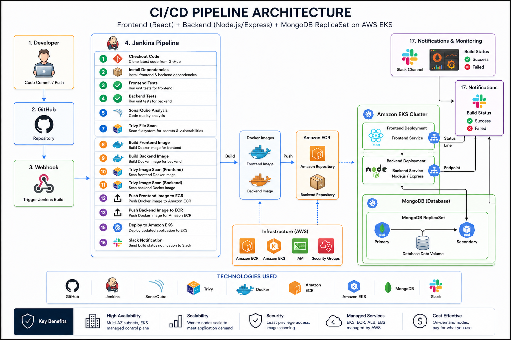
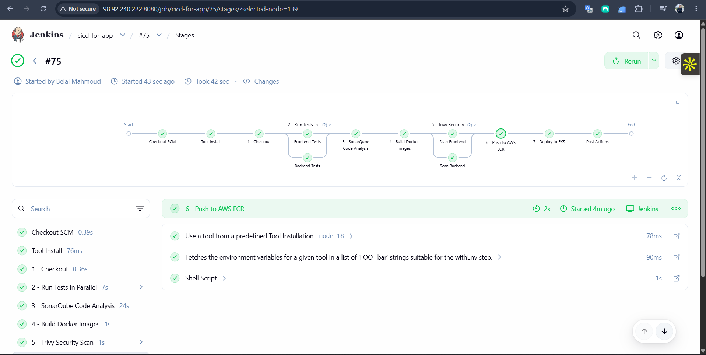
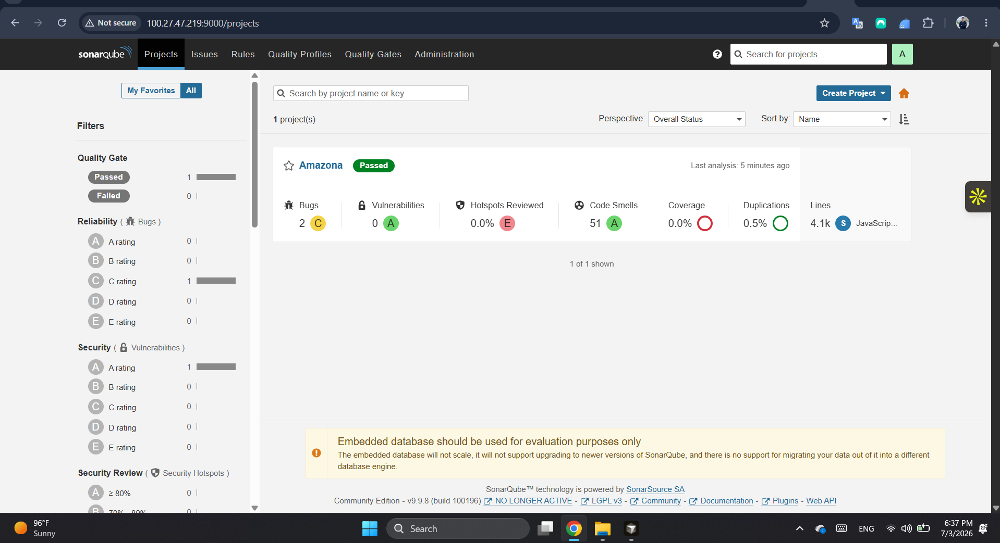
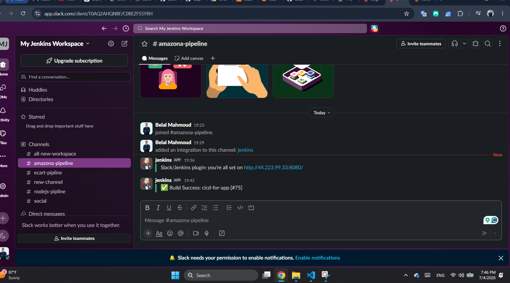

# Jenkins CI/CD Pipeline Documentation

**Project:** DEPI DevOps Graduation Project — Amazona E-Commerce Platform  
**Pipeline Job:** `cicd-for-app`  
**Repository:** `depi-devops-graduation-project`  
**Last Updated:** July 2026

---

## Table of Contents

1. [Executive Summary](#1-executive-summary)
2. [Project Architecture](#2-project-architecture)
3. [CI/CD Architecture Overview](#3-cicd-architecture-overview)
4. [Jenkins Pipeline Overview](#4-jenkins-pipeline-overview)
5. [Prerequisites and Jenkins Configuration](#5-prerequisites-and-jenkins-configuration)
6. [Pipeline Environment and Credentials](#6-pipeline-environment-and-credentials)
7. [Pipeline Stages — Detailed Breakdown](#7-pipeline-stages--detailed-breakdown)
8. [Code Quality — SonarQube Analysis](#8-code-quality--sonarqube-analysis)
9. [Security Scanning — OWASP Dependency Check](#9-security-scanning--owasp-dependency-check)
10. [Notifications — Slack Integration](#10-notifications--slack-integration)
11. [Deployment to Amazon EKS](#11-deployment-to-amazon-eks)
12. [Pipeline Stage Summary Table](#12-pipeline-stage-summary-table)
13. [Troubleshooting and Best Practices](#13-troubleshooting-and-best-practices)

---

## 1. Executive Summary

This document describes the **Continuous Integration and Continuous Deployment (CI/CD)** pipeline for the **Amazona** full-stack e-commerce application. The pipeline is implemented as a **Declarative Jenkins Pipeline** defined in the root `Jenkinsfile` and orchestrates the full software delivery lifecycle:

- Source code checkout from GitHub
- Automated testing (frontend and backend in parallel)
- Static code analysis with SonarQube
- Docker image build and security scanning with Trivy
- Image push to Amazon Elastic Container Registry (ECR)
- Rolling deployment to Amazon Elastic Kubernetes Service (EKS)
- Real-time build notifications via Slack

The pipeline enforces quality and security gates before any code reaches production, following modern DevOps practices for a **React + Node.js/Express + MongoDB** application running on **AWS EKS**.

---

## 2. Project Architecture

### 2.1 Application Architecture (3-Tier)

Amazona is a cloud-native e-commerce platform built with a classic **three-tier architecture**:

| Tier | Technology | Role | Replicas (EKS) |
|------|------------|------|----------------|
| **Presentation** | React.js + Nginx | User interface, static assets, routing | 2 pods |
| **Application** | Node.js + Express | REST API, business logic, authentication | 2 pods |
| **Data** | MongoDB 7 (Replica Set) | Persistent product, user, and order data | 3 pods |

**Traffic flow:**

```
User → AWS ALB → Kubernetes Ingress
                      ├── /*       → Frontend Service (port 80)  → React pods
                      └── /api/*   → Backend Service (port 5000) → Node.js pods
                                                                          └── MongoDB Replica Set
                                                                               ├── mongo-0 (PRIMARY)
                                                                               ├── mongo-1 (SECONDARY)
                                                                               └── mongo-2 (SECONDARY)
```

### 2.2 Infrastructure Architecture (AWS)

Infrastructure is provisioned using **Terraform** (Infrastructure as Code) and includes:

| AWS Service | Purpose |
|-------------|---------|
| **VPC** | Isolated network (10.0.0.0/16) with public subnets across 2 AZs |
| **Amazon EKS** | Managed Kubernetes cluster (`amazona-dev-cluster`, K8s 1.31) |
| **Amazon ECR** | Private container registry for `amazona-frontend` and `amazona-backend` images |
| **Amazon EBS (gp2)** | Persistent volumes for MongoDB StatefulSet |
| **AWS ALB** | Internet-facing Application Load Balancer via AWS Load Balancer Controller |
| **Amazon S3** | Remote Terraform state backend |
| **IAM + IRSA** | Least-privilege roles for EKS nodes, ALB Controller, and EBS CSI Driver |

### 2.3 Repository Structure (Relevant to CI/CD)

```
depi-devops-graduation-project/
├── Jenkinsfile              # Declarative CI/CD pipeline definition
├── frontend/                # React application + Dockerfile
├── backend/                 # Node.js API + Dockerfile
├── k8s/                     # Kubernetes manifests (deployments, services, ingress)
├── terraform/               # AWS infrastructure modules (VPC, EKS, ECR)
├── docker-compose.yml       # Local development stack
└── deploy.sh                # Manual deployment helper script
```

---

## 3. CI/CD Architecture Overview

The following diagram illustrates the **end-to-end Enhanced CI/CD Pipeline Architecture**, from developer commit to production deployment and monitoring.



### 3.1 Architecture Flow

The CI/CD architecture follows this high-level flow:

```
Developer → GitHub (Push) → Webhook → Jenkins Pipeline
                                              │
                    ┌─────────────────────────┼─────────────────────────┐
                    ▼                         ▼                         ▼
              Quality Gates            Security Scans              Build & Deploy
         (Tests, SonarQube,         (OWASP, Trivy File/Image)    (Docker → ECR → EKS)
          OWASP Dependency Check)
                    │                         │                         │
                    └─────────────────────────┴─────────────────────────┘
                                              │
                                              ▼
                              Amazon EKS Cluster (Frontend + Backend + MongoDB)
                                              │
                                              ▼
                              Slack Notifications + Monitoring
```

### 3.2 Key Components in the Architecture

| Component | Role in the Pipeline |
|-----------|---------------------|
| **GitHub** | Source code repository; webhook triggers Jenkins on push |
| **Jenkins** | CI/CD orchestrator; executes all pipeline stages |
| **SonarQube** | Static code analysis, quality gates, code smells detection |
| **OWASP Dependency Check** | Scans npm dependencies for known CVEs |
| **Trivy** | Container and filesystem vulnerability scanning |
| **Docker** | Builds production-ready container images |
| **Amazon ECR** | Stores versioned Docker images (`:latest` + `:BUILD_NUMBER`) |
| **Amazon EKS** | Target Kubernetes cluster for application deployment |
| **Slack** | Real-time build success/failure notifications |

### 3.3 Technologies Used

GitHub · Jenkins · SonarQube · OWASP Dependency Check · Trivy · Docker · Amazon ECR · Amazon EKS · MongoDB · Slack

---

## 4. Jenkins Pipeline Overview

The Jenkins pipeline job **`cicd-for-app`** executes the stages defined in the `Jenkinsfile`. The screenshot below shows a successful pipeline run (Build #75), including stage timings and parallel execution branches.



### 4.1 Pipeline Characteristics

| Property | Value |
|----------|-------|
| **Pipeline Type** | Declarative Pipeline (`pipeline { }`) |
| **Agent** | `any` (runs on any available Jenkins agent with Docker) |
| **Node.js Tool** | `node-18` (configured in Jenkins Global Tool Configuration) |
| **SonarQube Scanner** | `SonarQubeScanner` (configured as Jenkins tool) |
| **AWS Region** | `us-east-1` |
| **EKS Cluster** | `amazona-dev-cluster` |
| **Typical Duration** | ~42 seconds (Build #75) |

### 4.2 Pipeline Visual Flow

```
Checkout SCM → Tool Install → 1-Checkout
                                    │
                                    ▼
                         2-Run Tests in Parallel
                         ├── Frontend Tests
                         └── Backend Tests
                                    │
                                    ▼
                         3-SonarQube Code Analysis
                                    │
                                    ▼
                         4-Build Docker Images
                                    │
                                    ▼
                         5-Trivy Security Scan (Parallel)
                         ├── Scan Frontend
                         └── Scan Backend
                                    │
                                    ▼
                         6-Push to AWS ECR
                                    │
                                    ▼
                         7-Deploy to EKS
                                    │
                                    ▼
                              Post Actions
                         (Slack Notification)
```

---

## 5. Prerequisites and Jenkins Configuration

### 5.1 Jenkins Server Requirements

The Jenkins agent must have the following tools installed and available on `PATH`:

| Tool | Purpose |
|------|---------|
| **Git** | Source code checkout |
| **Node.js 18** | Frontend and backend test execution |
| **Docker** | Image build, tag, and push |
| **AWS CLI** | ECR login and EKS kubeconfig update |
| **kubectl** | Kubernetes deployment rollout |
| **Trivy** | Container vulnerability scanning |
| **SonarQube Scanner** | Static code analysis |

### 5.2 Required Jenkins Plugins

- **Pipeline** — Declarative pipeline support
- **Git / GitHub** — SCM integration and webhooks
- **NodeJS Plugin** — Node.js tool provisioning
- **SonarQube Scanner** — SonarQube integration (`withSonarQubeEnv`)
- **Credentials Binding** — Secure AWS credential injection
- **Slack Notification** — `slackSend` post-build notifications
- **Docker Pipeline** (optional) — Enhanced Docker integration

### 5.3 Jenkins Global Tool Configuration

| Tool Name | Configuration |
|-----------|---------------|
| `node-18` | Node.js 18.x installation path |
| `SonarQubeScanner` | SonarQube Scanner CLI installation |

### 5.4 SonarQube Server Configuration

Configure a SonarQube server in Jenkins under **Manage Jenkins → Configure System**:

- **Name:** `sonar-server`
- **Server URL:** SonarQube instance (e.g., `http://100.27.47.219:9000`)
- **Authentication:** Server authentication token

### 5.5 GitHub Webhook

A GitHub webhook is configured to trigger the Jenkins job on every push to the repository:

```
POST http://<jenkins-server>:8080/github-webhook/
```

---

## 6. Pipeline Environment and Credentials

### 6.1 Environment Variables

Defined in the `Jenkinsfile` `environment` block:

| Variable | Description | Example |
|----------|-------------|---------|
| `SCANNER_HOME` | Path to SonarQube Scanner CLI | `/var/jenkins/tools/.../sonar-scanner` |
| `AWS_REGION` | AWS deployment region | `us-east-1` |
| `AWS_ACCOUNT_ID` | AWS account ID (from Jenkins credential) | `608645726975` |
| `ECR_REGISTRY` | ECR registry URL | `{account}.dkr.ecr.us-east-1.amazonaws.com` |
| `ECR_BACKEND` | Backend ECR repository URI | `.../amazona-backend` |
| `ECR_FRONTEND` | Frontend ECR repository URI | `.../amazona-frontend` |
| `IMAGE_TAG` | Docker image tag for this build | Jenkins `BUILD_NUMBER` |

### 6.2 Jenkins Credentials

| Credential ID | Type | Usage |
|---------------|------|-------|
| `aws-account-id` | Secret text | Resolves ECR registry URL |
| `aws-credentials` | Username/Password | AWS Access Key ID + Secret Access Key for ECR push and EKS deploy |

> **Security Note:** Never commit AWS credentials or secrets to the repository. All sensitive values are stored in Jenkins Credentials Manager.

---

## 7. Pipeline Stages — Detailed Breakdown

This section explains each stage implemented in the `Jenkinsfile`, including purpose, commands, and expected outcomes.

---

### Stage 1 — Checkout

**Summary:** Retrieves the latest source code from the Git repository.

```groovy
stage('1 - Checkout') {
    steps {
        checkout scm
    }
}
```

| Detail | Description |
|--------|-------------|
| **Purpose** | Clone or update the workspace with the commit that triggered the build |
| **Input** | GitHub repository branch (configured in Jenkins job SCM settings) |
| **Output** | Full project workspace on the Jenkins agent |
| **Typical Duration** | ~0.36s |

The checkout stage ensures Jenkins has the exact version of `frontend/`, `backend/`, `k8s/`, and `Jenkinsfile` needed for subsequent stages.

---

### Stage 2 — Run Tests in Parallel

**Summary:** Executes frontend and backend unit tests concurrently to reduce pipeline duration.

```groovy
stage('2 - Run Tests in Parallel') {
    parallel {
        stage('Frontend Tests') { ... }
        stage('Backend Tests') { ... }
    }
}
```

#### Frontend Tests

| Detail | Description |
|--------|-------------|
| **Working Directory** | `frontend/` |
| **Commands** | `npm install` → `npm test -- --watchAll=false --coverage=false --passWithNoTests` |
| **Framework** | Jest (React Testing Library) |
| **Purpose** | Validates React components and frontend logic |

#### Backend Tests

| Detail | Description |
|--------|-------------|
| **Working Directory** | `backend/` |
| **Commands** | `npm ci --legacy-peer-deps` → `npm test` |
| **Framework** | Jest + Supertest |
| **Purpose** | Validates API routes, models, and business logic |

| Detail | Description |
|--------|-------------|
| **Parallel Execution** | Both test suites run simultaneously |
| **Failure Behavior** | Pipeline stops; no deployment occurs |
| **Typical Duration** | ~7s (combined parallel) |

---

### Stage 3 — SonarQube Code Analysis

**Summary:** Performs static code analysis on frontend and backend source code and publishes results to SonarQube.

```groovy
stage('3 - SonarQube Code Analysis') {
    steps {
        withSonarQubeEnv('sonar-server') {
            sh """
                $SCANNER_HOME/bin/sonar-scanner \
                -Dsonar.projectName=Amazona \
                -Dsonar.projectKey=depi-devops-graduation-project \
                -Dsonar.sources=frontend/src,backend
            """
        }
    }
}
```

| Detail | Description |
|--------|-------------|
| **Purpose** | Detect bugs, vulnerabilities, code smells, and duplication |
| **Project Key** | `depi-devops-graduation-project` |
| **Scanned Paths** | `frontend/src`, `backend` |
| **Quality Gate** | Evaluated in SonarQube dashboard |
| **Typical Duration** | ~24s |

See [Section 8](#8-code-quality--sonarqube-analysis) for dashboard details and metrics.

---

### Stage 4 — Build Docker Images

**Summary:** Builds production Docker images for both frontend and backend applications.

```groovy
stage('4 - Build Docker Images') {
    steps {
        sh """
            docker build -t ${ECR_FRONTEND}:${IMAGE_TAG} ./frontend
            docker build -t ${ECR_BACKEND}:${IMAGE_TAG} ./backend
        """
    }
}
```

| Detail | Description |
|--------|-------------|
| **Frontend Image** | Multi-stage build: React build → Nginx serving static files |
| **Backend Image** | Multi-stage build: Babel compile → Node.js production runtime |
| **Image Tags** | Tagged with `BUILD_NUMBER` (e.g., `:75`) |
| **Typical Duration** | ~1s (with Docker layer cache) |

---

### Stage 5 — Trivy Security Scan

**Summary:** Scans built Docker images for HIGH and CRITICAL vulnerabilities in parallel.

```groovy
stage('5 - Trivy Security Scan') {
    parallel {
        stage('Scan Frontend') { ... }
        stage('Scan Backend') { ... }
    }
}
```

| Detail | Description |
|--------|-------------|
| **Tool** | Trivy (Aqua Security) |
| **Scan Target** | Built Docker images (not yet pushed to ECR) |
| **Severity Filter** | `HIGH,CRITICAL` |
| **Exit Code** | `0` (report only; does not fail pipeline on findings) |
| **Purpose** | Container image vulnerability assessment before registry push |
| **Typical Duration** | ~1s (parallel) |

> **Note:** The enhanced architecture diagram also includes a **Trivy File Scan** stage (pre-build filesystem scan). The current `Jenkinsfile` implements **Trivy Image Scan** post-build.

---

### Stage 6 — Push to AWS ECR

**Summary:** Authenticates with ECR, tags images as `latest`, and pushes both versioned and latest tags.

```groovy
stage('6 - Push to AWS ECR') {
    steps {
        withCredentials([...]) {
            sh """
                aws ecr get-login-password --region ${AWS_REGION} | \
                docker login --username AWS --password-stdin ${ECR_REGISTRY}

                docker tag ${ECR_FRONTEND}:${IMAGE_TAG} ${ECR_FRONTEND}:latest
                docker tag ${ECR_BACKEND}:${IMAGE_TAG} ${ECR_BACKEND}:latest

                docker push ${ECR_FRONTEND}:${IMAGE_TAG}
                docker push ${ECR_FRONTEND}:latest
                docker push ${ECR_BACKEND}:${IMAGE_TAG}
                docker push ${ECR_BACKEND}:latest
            """
        }
    }
}
```

| Detail | Description |
|--------|-------------|
| **Authentication** | AWS credentials injected via Jenkins Credentials Binding |
| **Repositories** | `amazona-frontend`, `amazona-backend` |
| **Tags Pushed** | `:BUILD_NUMBER` and `:latest` for each image |
| **Purpose** | Store immutable build artifacts in private AWS registry |
| **Typical Duration** | ~2s |

Kubernetes deployments reference the `:latest` tag with `imagePullPolicy: Always`, ensuring new images are pulled on rollout restart.

---

### Stage 7 — Deploy to EKS

**Summary:** Updates kubeconfig for the EKS cluster and triggers a rolling restart of frontend and backend deployments.

```groovy
stage('7 - Deploy to EKS') {
    steps {
        withCredentials([...]) {
            sh """
                aws eks update-kubeconfig \
                  --region ${AWS_REGION} \
                  --name amazona-dev-cluster

                kubectl rollout restart deployment/backend
                kubectl rollout restart deployment/frontend
            """
        }
    }
}
```

| Detail | Description |
|--------|-------------|
| **Cluster** | `amazona-dev-cluster` (us-east-1) |
| **Deploy Strategy** | Rolling restart (pulls latest ECR images) |
| **Affected Resources** | `deployment/backend`, `deployment/frontend` |
| **MongoDB** | Not restarted (StatefulSet; data persists across deploys) |
| **Purpose** | Zero-downtime application update on EKS |

See [Section 11](#11-deployment-to-amazon-eks) for the full deployment topology.

---

### Post Actions — Slack Notifications

**Summary:** Sends build status to the team Slack channel after pipeline completion.

```groovy
post {
    success {
        slackSend(
            channel: '#amazona-pipeline',
            color: 'good',
            message: "✅ Build Success: ${env.JOB_NAME} [#${env.BUILD_NUMBER}]"
        )
    }
    failure {
        slackSend(
            channel: '#amazona-pipeline',
            color: 'danger',
            message: "❌ Build Failed: ${env.JOB_NAME} [#${env.BUILD_NUMBER}]"
        )
    }
}
```

See [Section 10](#10-notifications--slack-integration) for Slack setup details.

---

## 8. Code Quality — SonarQube Analysis

SonarQube provides continuous inspection of code quality and security. After Stage 3 completes, analysis results are available on the SonarQube dashboard.



### 8.1 Project Metrics (Example: Build Analysis)

| Metric | Value | Rating |
|--------|-------|--------|
| **Quality Gate** | Passed | ✅ |
| **Reliability (Bugs)** | 2 bugs | C |
| **Security (Vulnerabilities)** | 0 vulnerabilities | A |
| **Security Review (Hotspots)** | 0.0% reviewed | E |
| **Maintainability (Code Smells)** | 51 code smells | A |
| **Coverage** | 0.0% | — |
| **Duplications** | 0.5% | ✅ |
| **Lines of Code** | 4.1k (JavaScript) | — |

### 8.2 What SonarQube Checks

- **Bugs** — Logic errors that could cause unexpected behavior
- **Vulnerabilities** — Security flaws (SQL injection, XSS, etc.)
- **Code Smells** — Maintainability issues (complexity, naming, dead code)
- **Duplications** — Copy-pasted code blocks
- **Security Hotspots** — Code requiring manual security review

### 8.3 SonarQube in the Pipeline

SonarQube acts as a **quality gate** between testing and deployment. Developers should review the SonarQube dashboard after each build and address critical issues before merging to the main branch.

---

## 9. Security Scanning — OWASP Dependency Check

The enhanced CI/CD architecture includes **OWASP Dependency Check** as a dedicated security stage. This tool scans npm dependencies in both `frontend/` and `backend/` for known vulnerabilities (CVEs) listed in the National Vulnerability Database (NVD).


### 9.1 What the Screenshot Shows

The Jenkins workspace for build `#56` contains generated OWASP Dependency Check artifacts:

| File | Description |
|------|-------------|
| `dependency-check-report.html` | Human-readable HTML vulnerability report |
| `dependency-check-report.xml` | Machine-readable XML report for CI integration |
| `.scannerwork/` | SonarQube scanner working directory |

### 9.2 OWASP Dependency Check — Purpose

| Aspect | Detail |
|--------|--------|
| **Scan Target** | `package.json` / `package-lock.json` dependencies |
| **Database** | NVD (National Vulnerability Database) |
| **Output** | CVE list with severity scores (CVSS) |
| **Pipeline Role** | Prevents deployment of code with known vulnerable dependencies |

### 9.3 Relationship to Other Security Tools

| Tool | Scope | Stage in Architecture |
|------|-------|----------------------|
| **SonarQube** | Source code quality and SAST | Stage 5 (Architecture) / Stage 3 (Jenkinsfile) |
| **OWASP Dependency Check** | Third-party dependency CVEs | Stage 6 (Architecture) |
| **Trivy File Scan** | Filesystem secrets and misconfigurations | Stage 7 (Architecture) |
| **Trivy Image Scan** | Container OS and package vulnerabilities | Stage 10–11 (Architecture) / Stage 5 (Jenkinsfile) |

Together, these tools provide **defense in depth** across source code, dependencies, and container images.

---

## 10. Notifications — Slack Integration

The pipeline integrates with **Slack** to provide immediate feedback to the development team on every build outcome.



### 10.1 Slack Configuration

| Setting | Value |
|---------|-------|
| **Workspace** | My Jenkins Workspace |
| **Channel** | `#amazona-pipeline` |
| **Jenkins Plugin** | Slack Notification Plugin |
| **Jenkins Server** | `http://44.223.99.33:8080/` |

### 10.2 Notification Messages

| Event | Message Format | Color |
|-------|---------------|-------|
| **Success** | `✅ Build Success: cicd-for-app [#75]` | Green (`good`) |
| **Failure** | `❌ Build Failed: cicd-for-app [#75]` | Red (`danger`) |

### 10.3 Benefits

- **Immediate visibility** — Team knows within seconds if a deployment succeeded or failed
- **Audit trail** — Slack channel history serves as a build log for stakeholders
- **Rapid response** — Failed builds trigger immediate investigation without checking Jenkins manually

---

## 11. Deployment to Amazon EKS

After Stage 7, the updated application runs on the EKS cluster with the following topology:

### 11.1 EKS Workloads

| Resource | Type | Replicas | Image Source |
|----------|------|----------|--------------|
| `frontend` | Deployment | 2 | ECR `amazona-frontend:latest` |
| `backend` | Deployment | 2 | ECR `amazona-backend:latest` |
| `mongo-0/1/2` | StatefulSet | 3 | MongoDB 7 (unchanged by pipeline) |

### 11.2 Services and Ingress

| Resource | Purpose |
|----------|---------|
| `frontend-service` | ClusterIP — exposes frontend pods on port 80 |
| `backend-service` | ClusterIP — exposes backend pods on port 5000 |
| `amazona-ingress` | ALB Ingress — routes `/*` to frontend, `/api/*` to backend |

### 11.3 Deployment Strategy

The pipeline uses **`kubectl rollout restart`** rather than applying updated manifests. Because Kubernetes deployments reference `:latest` with `imagePullPolicy: Always`, a rollout restart:

1. Pulls the newly pushed ECR images
2. Creates new pods with updated containers
3. Terminates old pods gracefully (rolling update)
4. Maintains service availability throughout the update

---

## 12. Pipeline Stage Summary Table

Quick reference for all pipeline stages — both the **Enhanced Architecture** (16 stages) and the **Current Jenkinsfile** (7 stages):

### 12.1 Current Jenkinsfile Stages

| # | Stage | Summary | Parallel | Typical Duration |
|---|-------|---------|----------|-----------------|
| 1 | **Checkout** | Clone source code from GitHub | No | ~0.4s |
| 2 | **Run Tests in Parallel** | Frontend + Backend unit tests | Yes | ~7s |
| 3 | **SonarQube Code Analysis** | Static code quality and security scan | No | ~24s |
| 4 | **Build Docker Images** | Build frontend and backend container images | No | ~1s |
| 5 | **Trivy Security Scan** | Scan images for HIGH/CRITICAL CVEs | Yes | ~1s |
| 6 | **Push to AWS ECR** | Login, tag, and push images to ECR | No | ~2s |
| 7 | **Deploy to EKS** | Rolling restart of frontend and backend | No | ~5s |
| — | **Post: Slack Notification** | Success or failure alert to `#amazona-pipeline` | No | ~1s |

### 12.2 Enhanced Architecture Stages (Full Vision)

| # | Stage | Summary |
|---|-------|---------|
| 1 | Checkout Code | Retrieve latest commit from GitHub |
| 2 | Install Dependencies | `npm install` for frontend and backend |
| 3 | Frontend Tests | React/Jest unit tests |
| 4 | Backend Tests | Node.js/Jest API tests |
| 5 | SonarQube Analysis | Static application security testing (SAST) |
| 6 | OWASP Dependency Check | Scan npm packages for known CVEs |
| 7 | Trivy File Scan | Pre-build filesystem vulnerability scan |
| 8 | Build Frontend Image | Docker multi-stage React + Nginx build |
| 9 | Build Backend Image | Docker multi-stage Node.js build |
| 10 | Trivy Image Scan (Frontend) | Container vulnerability scan |
| 11 | Trivy Image Scan (Backend) | Container vulnerability scan |
| 12 | Push Frontend to ECR | Upload frontend image to registry |
| 13 | Push Backend to ECR | Upload backend image to registry |
| 14 | git-diff | Update Kubernetes manifest image tags |
| 15 | Deploy to Amazon EKS | Apply manifests / rollout to cluster |
| 16 | Slack Notification | Send build status to team channel |

---

## 13. Troubleshooting and Best Practices

### 13.1 Common Issues

| Issue | Likely Cause | Resolution |
|-------|-------------|------------|
| ECR push fails | Invalid AWS credentials or missing ECR repos | Verify `aws-credentials` in Jenkins; run `terraform apply` for ECR |
| EKS deploy fails | kubeconfig not updated or wrong cluster name | Confirm cluster `amazona-dev-cluster` exists in `us-east-1` |
| SonarQube scan fails | SonarQube server unreachable | Check `sonar-server` configuration and network access |
| Tests fail | Breaking code change | Fix failing tests locally before pushing |
| Docker build fails | Missing Dockerfile or build context | Verify `frontend/Dockerfile` and `backend/Dockerfile` exist |
| Slack notification missing | Plugin not configured | Install Slack Notification plugin and configure workspace token |

### 13.2 Best Practices

1. **Never skip tests** — Failed tests block deployment automatically
2. **Review SonarQube after each build** — Address bugs and security hotspots promptly
3. **Monitor Slack channel** — Treat failure notifications as actionable alerts
4. **Use immutable tags in production** — Consider deploying with `:BUILD_NUMBER` instead of `:latest` for traceability
5. **Rotate AWS credentials** — Update Jenkins credentials when IAM keys are rotated
6. **Keep Jenkins agents updated** — Ensure Docker, Trivy, and Node.js versions are current

### 13.3 Useful Commands (Manual Verification)

```bash
# Verify ECR images after push
aws ecr describe-images --repository-name amazona-frontend --region us-east-1

# Check EKS deployment status after pipeline
kubectl get pods
kubectl rollout status deployment/frontend
kubectl rollout status deployment/backend

# View application URL
kubectl get ingress amazona-ingress
```

---

<div align="center">

**DEPI DevOps Graduation Project — Jenkins CI/CD Documentation**  
*Amazona E-Commerce Platform · AWS EKS · 2026*

</div>
