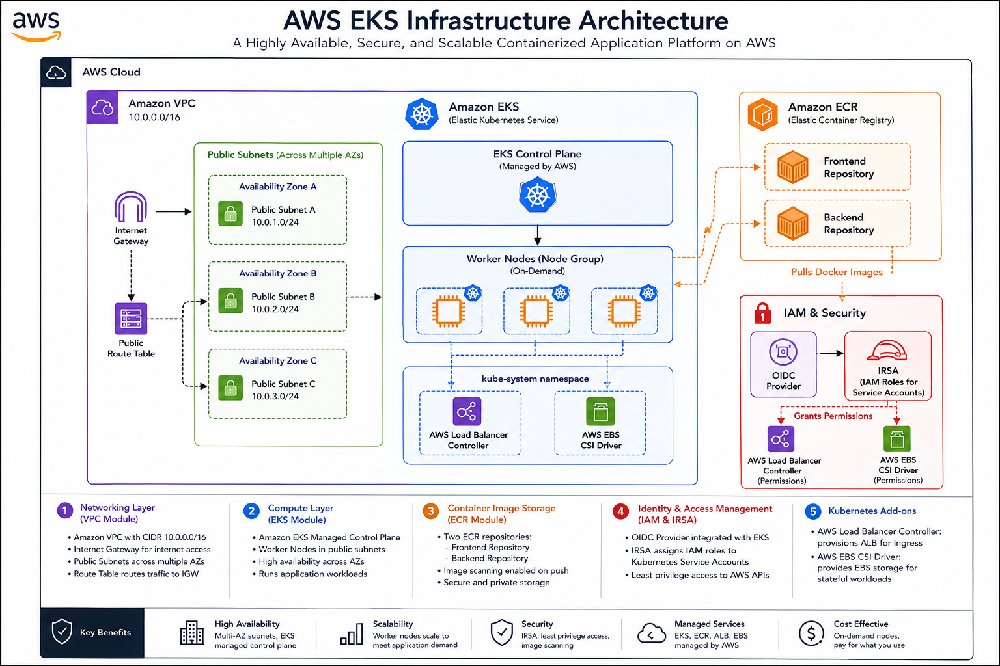

# DEPI DevOps Graduation Project — Amazona E-Commerce Platform

## 📖 Executive Summary

**Amazona** is a cloud-native, full-stack e-commerce web application built using the highly popular MERN stack (MongoDB, Express, React, Node.js). This repository is not just about the application source code; it serves as a comprehensive showcase of modern DevOps methodologies, Infrastructure as Code (IaC), Continuous Integration/Continuous Deployment (CI/CD), and Cloud-Native orchestration.

The project demonstrates a fully automated, highly available, and deeply secure infrastructure deployed on **Amazon Web Services (AWS)** using **Terraform**. The application is orchestrated via **Kubernetes (Amazon EKS)**, continuously integrated, tested, and deployed via a declarative **Jenkins** pipeline, and robustly monitored using **Prometheus, Grafana, and Alertmanager**.

This documentation serves as the ultimate guide to understanding the architecture, design decisions, and operational lifecycle of the Amazona platform.

---

## 1. 💻 Application Architecture (Source Code)

Amazona features a dynamic customer-facing storefront and a secure administrative management panel. The application is divided into deeply decoupled microservice-like tiers.

### Technical Stack:
- **Frontend (Presentation Tier):** Built with React.js, utilizing Redux for global state management and React Router for client-side routing. It is built as a static artifact and served by a lightweight Nginx web server within its Docker container.
- **Backend (Application Tier):** A robust RESTful API built on Node.js and Express.js. It handles business logic, JWT (JSON Web Token) authentication, file uploads via Multer, and seamless integration with the PayPal API for checkout.
- **Database (Data Tier):** MongoDB serves as the NoSQL database, structured using Mongoose ODM for data modeling and strict schema validation.

### Key Features:
- **For Customers:** Persistent shopping carts, secure login/registration, product filtering, multi-step checkout, and order history tracking.
- **For Administrators:** Full CRUD operations for products, order management dashboards, and image upload capabilities.

---

## 2. 🏗️ Infrastructure as Code (Terraform)

The foundational AWS infrastructure is provisioned securely, consistently, and predictably using **Terraform**. We adopted a highly modular approach, ensuring maximum reusability and adherence to the AWS Well-Architected Framework.

### Key Infrastructure Modules:
- **Networking (VPC Module):** 
  - Provisions an isolated Virtual Private Cloud (VPC) with a `10.0.0.0/16` CIDR block.
  - Distributes Public Subnets across multiple Availability Zones (AZs) to guarantee High Availability (HA) and fault tolerance.
  - **Design Decision:** Subnets are strictly tagged with `kubernetes.io/role/elb = 1`. This is a crucial requirement that allows the Kubernetes AWS Load Balancer Controller to dynamically discover subnets and provision Application Load Balancers (ALBs) into them.
- **Container Registry (ECR Module):** 
  - Provisions private Amazon Elastic Container Registries (ECR) for the `frontend` and `backend` images. 
  - **Security Decision:** `scan_on_push` is explicitly enabled. This integrates AWS native vulnerability scanning, ensuring every pushed Docker image is instantly assessed for CVEs (Common Vulnerabilities and Exposures).
- **Compute (EKS Module):** 
  - Provisions the EKS Control Plane and an On-Demand Worker Node Group (using `t3.medium` instances to accommodate both application and heavy monitoring workloads).
- **Security & IAM (OIDC & IRSA):** 
  - **Zero Trust Security:** Instead of granting broad, risky AWS permissions directly to the EC2 worker nodes, we utilize **IAM Roles for Service Accounts (IRSA)** integrated with an EKS OIDC (OpenID Connect) provider. 
  - This allows specific Kubernetes pods (like the ALB Controller and the EBS CSI Driver) to securely assume specific AWS IAM roles, enforcing the Principle of Least Privilege.

---

## 3. 🔄 CI/CD Pipeline (Jenkins & Docker)

The Continuous Integration and Continuous Deployment (CI/CD) pipeline is the heartbeat of our DevOps lifecycle. It is defined declaratively (`Jenkinsfile`) and triggers automatically on every GitHub push via Webhooks.

### Detailed Pipeline Stages:
1. **Parallel Testing:** Executes frontend (React/Jest) and backend (Node.js/Jest) unit tests simultaneously to drastically reduce pipeline execution time.
2. **Static Application Security Testing (SAST):** 
   - **SonarQube Analysis:** Scans the source code to detect bugs, vulnerabilities, code smells, and technical debt. It acts as a strict quality gate.
3. **Software Composition Analysis (SCA):**
   - **OWASP Dependency Check:** Scans `package.json` dependencies for known vulnerabilities listed in the National Vulnerability Database (NVD).
4. **Multi-Stage Docker Builds:** Compiles optimized, production-ready Docker images. For the frontend, it builds the React app and copies only the static artifacts into a lightweight Nginx image.
5. **Container Security Scanning:** 
   - **Trivy Scan:** Scans the newly built Docker images for HIGH and CRITICAL vulnerabilities before they are ever pushed to a registry.
6. **Artifact Storage:** Authenticates and pushes versioned (`:BUILD_NUMBER`) and `:latest` images to AWS ECR.
7. **Continuous Deployment (EKS):** 
   - Triggers a zero-downtime rolling update (`kubectl rollout restart`) on the Kubernetes deployments. Kubernetes intelligently spins up new pods, waits for them to pass Readiness Probes, and gracefully terminates the old ones.
8. **Real-time Alerting:** Integrates with Slack to send instant success/failure notifications to the DevOps team, ensuring rapid feedback loops.

---

## 4. ☸️ Kubernetes Orchestration (AWS EKS)

The application runs inside Amazon EKS with a robust, highly-available, and self-healing topology.

### Workload Topology:
- **Frontend & Backend Deployments:** Running 2 replicas each, ensuring no single point of failure. Exposed internally via Kubernetes `ClusterIP` services.
- **Database (MongoDB StatefulSet):** 
  - Runs a 3-replica MongoDB Replica Set (1 Primary, 2 Secondaries). 
  - **Design Decision:** We deliberately chose a **StatefulSet** over a Deployment because databases require stable network identifiers (`mongo-0`, `mongo-1`) and persistent storage.
  - Using the AWS EBS CSI Driver, Kubernetes dynamically provisions persistent `gp2` block storage volumes so data survives pod restarts.
- **Ingress / Load Balancing:** 
  - Managed by the AWS Application Load Balancer (ALB) Controller. It intelligently routes internet traffic based on paths (`/*` routes to the React frontend, `/api/*` routes to the Node.js backend).
- **Horizontal Pod Autoscaler (HPA):** 
  - Actively monitors CPU utilization. If traffic spikes and CPU exceeds 70%, HPA automatically scales the pods out (up to 5 replicas) to handle the load, scaling back in when traffic subsides.

---

## 5. 📊 Observability (Monitoring & Alerts)

A comprehensive observability stack runs directly inside the EKS cluster within a dedicated `monitoring` namespace, providing deep insights into cluster and application health.

### The Monitoring Stack:
- **Prometheus (Time-Series Database):** Scrapes metrics from nodes, pods, and cluster resources every 15 seconds. It utilizes `kube-state-metrics` to translate Kubernetes object states into readable metrics.
- **Grafana (Visualization):** Connects directly to Prometheus. We deployed custom dashboards for Cluster CPU/Memory tracking, Namespace resource quotas, Node health, and Persistent Volume capacity. 
  - **Design Decision:** Grafana is exposed securely via the *existing* ALB Ingress controller rather than creating a new Classic Load Balancer. This saves costs and simplifies infrastructure teardown.
- **Alertmanager & Slack:** Integrated with Prometheus alerting rules. If the cluster experiences anomalies, it fires critical alerts directly to our Slack channel. 
  - *Example Alerts:* `PodCrashLooping` (Critical), `HighMemoryUsage` (> 80%), `NodeNotReady` (Critical).

---

## 🚀 Local Development Setup

To run the application locally without Kubernetes or AWS:

### Prerequisites
- Node.js (v18+)
- Local MongoDB instance running

### Steps
1. Clone the repository.
2. In the `backend` folder, create a `.env` file with `MONGODB_URL=mongodb://localhost:27017/amazona` and `JWT_SECRET=your_secret`.
3. Run `npm install` in both `frontend` and `backend` directories.
4. Run `npm run seed` inside the backend to populate mock data.
5. Run `npm start` in the `backend` directory.
6. Run `npm start` in the `frontend` directory. The app will be available at `http://localhost:3000`.

---

## 👥 Meet The Team

This project was developed by a dedicated team of DevOps Engineers as part of the **DEPI DevOps Graduation Project**.

| Name | Role / Focus Area | Contact |
|------|-------------------|---------|
| **Belal Mahmoud** | Cloud Infrastructure & DevOps | [belal1652005@gmail.com](mailto:belal1652005@gmail.com) |
| **Yousef Waguih Hosny** | Kubernetes & Automation | [yousefwaguih@gmail.com](mailto:yousefwaguih@gmail.com) |
| **Moustafa Sakr** | CI/CD Pipelines & Security | [moustafa52@gmail.com](mailto:moustafa52@gmail.com.github.com) |
| **Muhammad Abdelkader** | Architecture & Monitoring | [moha7med.abdelkader@gmail.com](mailto:moha7med.abdelkader@gmail.com) |

> *Note: Roles are illustrative of the collaborative effort in delivering this end-to-end DevOps pipeline.*

---
*End of Documentation - 2026*
