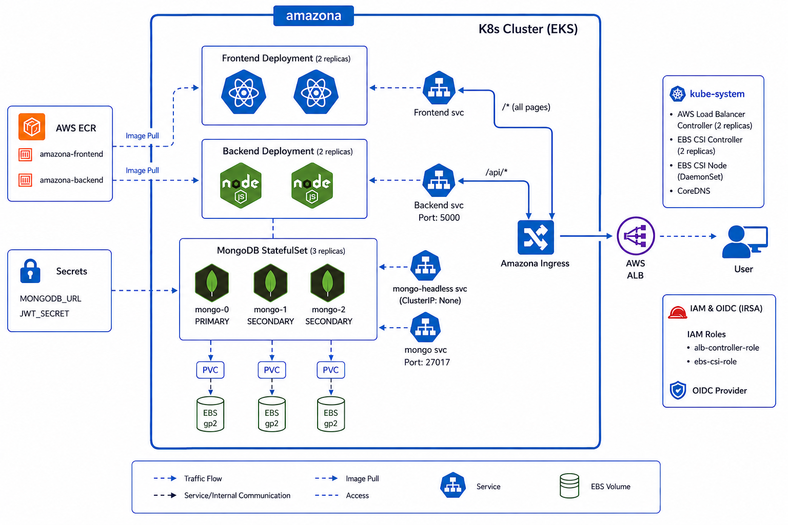

# 🛒 Amazona E-Commerce Platform — DevOps Capstone Project


## 📖 Table of Contents

1. [Project Overview](#-project-overview)
2. [Architecture Deep Dive](#-architecture-deep-dive)
3. [Technology Stack](#-technology-stack)
4. [Detailed Documentation](#-detailed-documentation)
5. [Prerequisites](#-prerequisites)
6. [Installation & Deployment Guide](#-installation--deployment-guide)
7. [Monitoring & Observability](#-monitoring--observability)
8. [Troubleshooting](#-troubleshooting)
9. [Local Development Setup](#-local-development-setup)
10. [👥 Team](#-team)

---

## 🌟 Project Overview

**Amazona** is a cloud-native, full-stack e-commerce web application built using the **MERN stack** (MongoDB, Express, React, Node.js). This repository showcases modern DevOps practices — Infrastructure as Code (IaC), CI/CD, and cloud-native orchestration.

The project demonstrates a fully automated infrastructure deployed on **Amazon Web Services (AWS)** using **Terraform**, with the application orchestrated on **Amazon EKS**, continuously integrated and deployed via **Jenkins**, and monitored using **Prometheus, Grafana, and Alertmanager**.


*Figure 1: High-Level Project Architecture*

### Key Features

- **High Availability** — Public subnets distributed across multiple Availability Zones.
- **Scalability** — Horizontal Pod Autoscaler (HPA) on the backend deployment.
- **Infrastructure as Code** — AWS infrastructure provisioned with Terraform modules.
- **Continuous Delivery** — Jenkins pipeline with testing, SonarQube analysis, Trivy scanning, and EKS deployment.
- **Observability** — Prometheus, Grafana, and Alertmanager with Slack notifications.

### Application Features

- **For Customers:** Shopping carts, login/registration, product filtering, checkout, and order history.
- **For Administrators:** CRUD operations for products, order management dashboards, and image uploads.

### 📂 Project Structure

```bash
depi-devops-graduation-project-dev/
├── backend/                # Node.js REST API
├── frontend/               # React application
├── terraform/              # AWS infrastructure (VPC, EKS, ECR)
│   └── modules/            # Terraform modules (vpc, eks, ecr)
├── k8s/                    # Kubernetes manifests
├── monitoring/             # Prometheus, Grafana, Alertmanager config
├── Documentation/          # Component documentation & diagrams
├── deploy.sh               # Application deployment script
├── install-monitoring.sh   # Monitoring stack installation script
├── docker-compose.yml      # Local Docker setup
├── Jenkinsfile             # CI/CD pipeline definition
└── README.md
```

---

## 🏗️ Architecture Deep Dive

### Infrastructure Design (Terraform)

The AWS infrastructure is provisioned using **Terraform** with a modular approach.


*Figure 2: Terraform Infrastructure Overview*

- **VPC Module** — Isolated VPC with `10.0.0.0/16` CIDR block and public subnets across multiple AZs, tagged with `kubernetes.io/role/elb = 1` for ALB provisioning.
- **ECR Module** — Private registries for `frontend` and `backend` images with `scan_on_push` enabled.
- **EKS Module** — EKS control plane and on-demand worker node group (`t3.medium` instances).
- **IAM & IRSA** — OIDC provider and IAM Roles for Service Accounts, allowing pods like the ALB Controller to assume scoped IAM roles.
- **ALB Controller** — Installed via Helm release in Terraform.

### Kubernetes Orchestration (Amazon EKS)

The application runs on **Amazon EKS** with the following topology:


*Figure 3: Kubernetes Workload Topology on EKS*

- **Frontend & Backend Deployments** — 2 replicas each, exposed via `ClusterIP` services.
- **MongoDB StatefulSet** — 3-replica replica set with persistent EBS volumes via the AWS EBS CSI Driver.
- **Ingress / Load Balancing** — AWS ALB Controller routes traffic (`/` → Frontend, `/api` → Backend).
- **Horizontal Pod Autoscaler (HPA)** — Backend HPA scales from 2 to 6 replicas based on 70% CPU utilization.

### CI/CD Pipeline (Jenkins)

The pipeline is defined in `Jenkinsfile` and triggers on GitHub push via webhook.


*Figure 4: CI/CD Pipeline Flow*

1. **Checkout** — Pull latest code from GitHub.
2. **Run Tests in Parallel** — Frontend and backend unit tests (Jest).
3. **SonarQube Code Analysis** — Static code analysis on frontend and backend sources.
4. **Build Docker Images** — Build frontend and backend container images.
5. **Trivy Security Scan** — Scan both images for HIGH and CRITICAL vulnerabilities.
6. **Push to AWS ECR** — Push versioned (`BUILD_NUMBER`) and `:latest` tags to ECR.
7. **Deploy to EKS** — Rolling restart of frontend and backend deployments.
8. **Slack Notification** — Success or failure alert to `#amazona-pipeline`.

---

## 🛠️ Technology Stack

### ☁️ Cloud & Infrastructure


### ⚙️ DevOps & Orchestration


### 📊 Monitoring


### 💻 Application


---

## 📚 Detailed Documentation

| Component | Description | Documentation Link |
| :--- | :--- | :--- |
| **Terraform** | VPC, EKS, ECR, and IAM/IRSA provisioning | [Terraform Docs](Documentation/Terraform_Documentation.md.md) |
| **Kubernetes (EKS)** | Cluster architecture, manifests, and deployment | [EKS Docs](Documentation/EKS-README.md) |
| **CI/CD Pipeline** | Jenkins pipeline stages and configuration | [Jenkins Docs](Documentation/Jenkins_Documentation.md) |
| **Monitoring** | Prometheus, Grafana, Alertmanager, and Slack alerts | [Monitoring Docs](Documentation/MONITORING-README.md) |
| **Source Code** | Application codebase structure (React/Node.js) | [Source Code Docs](Documentation/Source_Code_Documentation.md) |

---

## 📋 Prerequisites

1. **AWS Account** with appropriate permissions.
2. **AWS CLI** — configured via `aws configure`.
3. **Terraform** — v1.0+.
4. **kubectl** — installed locally.
5. **Docker** — for building and pushing images.
6. **Helm** — v3+ (for monitoring stack and ALB Controller).

---

## 🚀 Installation & Deployment Guide

### Step 1: Infrastructure Provisioning (Terraform)

```bash
cd terraform
terraform init
terraform plan
terraform apply
```

### Step 2: Configure kubectl

```bash
aws eks update-kubeconfig --region us-east-1 --name amazona-dev-cluster
kubectl get nodes
```

### Step 3: Application Deployment

```bash
chmod +x deploy.sh
./deploy.sh
```

The script connects to EKS, pushes images to ECR, creates backend secrets, applies Kubernetes manifests, initializes the MongoDB replica set, and restarts the backend.

### Step 4: Monitoring Stack

```bash
chmod +x install-monitoring.sh
./install-monitoring.sh
```

### Step 5: Jenkins CI/CD

Configure a Jenkins pipeline job using the `Jenkinsfile` in this repository. See [Jenkins Documentation](Documentation/Jenkins_Documentation.md) for credentials, tools, and webhook setup.

---

## 📊 Monitoring & Observability

The monitoring stack runs inside the EKS cluster in the `monitoring` namespace.

- **Prometheus** — Collects metrics from nodes, pods, and cluster resources via `kube-state-metrics`.
- **Grafana** — Dashboards for cluster CPU/memory, namespace resources, node health, and persistent volume capacity. Exposed via ALB Ingress.
- **Alertmanager** — Sends alerts to Slack on anomalies.

**Configured Alerts:**

- `HighCPUUsage` / `CriticalCPUUsage`
- `HighMemoryUsage` / `CriticalMemoryUsage`
- `PodCrashLooping` / `PodNotReady`
- `NodeNotReady` / `InstanceDown`
- `DiskSpaceLow` / `DiskSpaceCritical`

See [Monitoring Documentation](Documentation/MONITORING-README.md) for access instructions and dashboard details.

---

## 🔧 Troubleshooting

- **Jenkins build fails on ECR push** — Verify ECR repositories exist and Jenkins has valid AWS credentials (`aws-credentials`, `aws-account-id`).
- **Pods stuck in Pending** — Check if PVCs are bound and the EBS CSI driver is installed.
- **Ingress returns 404** — Ensure the ALB Controller is running and the Ingress has a valid ALB address.
- **Backend cannot connect to MongoDB** — Verify `backend-secrets` exists and the MongoDB replica set is initialized (see `deploy.sh`).

---

## 💻 Local Development Setup

### Prerequisites

- Node.js v18+
- Local MongoDB instance

### Steps

1. Clone the repository.
2. In the `backend` folder, create a `.env` file with `MONGODB_URL=mongodb://localhost:27017/amazona` and `JWT_SECRET=your_secret`.
3. Run `npm install` in both `frontend` and `backend`.
4. Run `npm run seed` inside `backend` to populate mock data.
5. Run `npm start` in `backend`, then in `frontend`.
6. Open the app at `http://localhost:3000`.

Alternatively, run locally with Docker Compose:

```bash
docker compose up --build
```

The app will be available at `http://localhost:3000`.

---

## 👥 Team

| Name | Contact |
|------|---------|
| *Belal Mahmoud* | [belal1652005@gmail.com](mailto:belal1652005@gmail.com) |
| *Yousef Waguih Hosny* | [yousefwaguih@gmail.com](mailto:yousefwaguih@gmail.com) |
| *Moustafa Sakr* | [moustafa52@gmail.com](mailto:moustafa52@gmail.com) |
| *Muhammad Abdelkader* | [moha7med.abdelkader@gmail.com](mailto:moha7med.abdelkader@gmail.com) |
| *Bola Hosny Refaat* | [bolahosny10@gmail.com](mailto:bolahosny10@gmail.com) |
| *Yousef Mohamed Saeed* | [youssef418293@feng.bu.edu.eg](mailto:youssef418293@feng.bu.edu.eg) |

---

*© 2026 DEPI DevOps Graduation Project. All Rights Reserved.*
