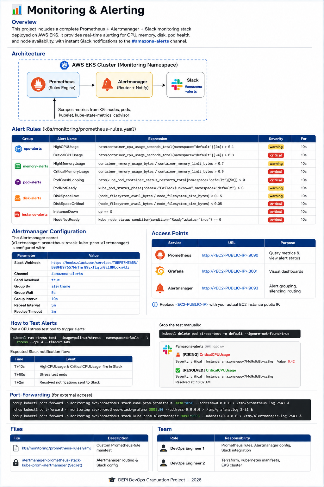

# 📊 Monitoring & Alerting

## Overview

The monitoring stack is built using **Prometheus**, **Alertmanager**, and **Grafana**, deployed on the AWS EKS cluster. It continuously collects Kubernetes metrics, evaluates alert rules, and sends real-time Slack notifications whenever predefined thresholds are exceeded.

### Features

- 📈 Prometheus metrics collection
- 🚨 Alertmanager alert routing
- 💬 Slack notifications
- 📊 Grafana dashboards
- 🖥️ Kubernetes node monitoring
- 📦 Pod health monitoring
- 💾 Disk usage monitoring
- ⚡ CPU & Memory monitoring

---

# Architecture



The monitoring workflow is:

```
Kubernetes Cluster
        │
        ▼
 Prometheus
 (Collect Metrics)
        │
        ▼
 Alert Rules
        │
        ▼
 Alertmanager
        │
        ▼
 Slack Notifications
```

---

# Alert Rules

| Category | Alert | Condition | Severity |
|-----------|---------|-----------|----------|
| CPU | HighCPUUsage | CPU usage > 10% | Warning |
| CPU | CriticalCPUUsage | CPU usage > 30% | Critical |
| Memory | HighMemoryUsage | Memory usage > 70% | Warning |
| Memory | CriticalMemoryUsage | Memory usage > 90% | Critical |
| Pods | PodCrashLooping | Restart rate > 0 | Critical |
| Pods | PodNotReady | Failed / Unknown | Warning |
| Disk | DiskSpaceLow | Available disk < 15% | Warning |
| Disk | DiskSpaceCritical | Available disk < 5% | Critical |
| Nodes | InstanceDown | Target unavailable | Critical |
| Nodes | NodeNotReady | Kubernetes node not Ready | Critical |

All alerts are configured with a **10-second evaluation period**.

---

# Alertmanager Configuration

| Setting | Value |
|----------|-------|
| Notification Channel | `#amazona-alerts` |
| Group By | `alertname` |
| Group Wait | `5s` |
| Group Interval | `10s` |
| Repeat Interval | `5m` |
| Resolve Timeout | `2m` |
| Send Resolved | Enabled |

> **Note:** The Slack webhook URL is intentionally omitted from this documentation for security reasons.

---

# Access Services

| Service | URL |
|---------|-----|
| Prometheus | `http://<EC2-PUBLIC-IP>:9090` |
| Grafana | `http://<EC2-PUBLIC-IP>:3001` |
| Alertmanager | `http://<EC2-PUBLIC-IP>:9093` |

Replace `<EC2-PUBLIC-IP>` with your EC2 public IP.

---

# Testing Alerts

Deploy a temporary CPU stress pod:

```bash
kubectl run stress-test \
--image=polinux/stress \
-n default \
-- stress --cpu 4 --timeout 60s
```

Expected behavior:

| Time | Result |
|------|--------|
| 10 seconds | HighCPUUsage alert |
| 10 seconds | CriticalCPUUsage alert |
| 60 seconds | Stress pod exits |
| ~2 minutes | Alert resolved notification sent |

Delete the pod if needed:

```bash
kubectl delete pod stress-test -n default --ignore-not-found=true
```

---

# Port Forwarding

Prometheus

```bash
nohup kubectl port-forward \
-n monitoring \
svc/prometheus-stack-kube-prom-prometheus \
9090:9090 \
--address=0.0.0.0 \
>/tmp/prometheus.log 2>&1 &
```

Grafana

```bash
nohup kubectl port-forward \
-n monitoring \
svc/prometheus-stack-grafana \
3001:80 \
--address=0.0.0.0 \
>/tmp/grafana.log 2>&1 &
```

Alertmanager

```bash
nohup kubectl port-forward \
-n monitoring \
svc/prometheus-stack-kube-prom-alertmanager \
9093:9093 \
--address=0.0.0.0 \
>/tmp/alertmanager.log 2>&1 &
```

---

# Project Files

```
k8s/
└── monitoring/
    └── prometheus-rules.yaml

monitoring-README/
└── monitoring-architecture.png
```

---

# Monitoring Components

- Prometheus
- Alertmanager
- Grafana
- kube-state-metrics
- Node Exporter
- cAdvisor
- Slack Integration

---

# Technologies Used

- Kubernetes
- AWS EKS
- Prometheus
- Alertmanager
- Grafana
- Helm
- Slack

---

# Team Responsibilities

| Team Member | Responsibility |
|-------------|----------------|
| DevOps Engineer 1 | Monitoring, Alert Rules, Alertmanager, Slack Integration |
| DevOps Engineer 2 | Terraform, AWS Infrastructure, Kubernetes Deployment |

---

## Result

✅ Real-time monitoring

✅ Automatic alerting

✅ Slack notifications

✅ CPU, Memory, Disk, Pod and Node monitoring

---

**DEPI DevOps Graduation Project – 2026**